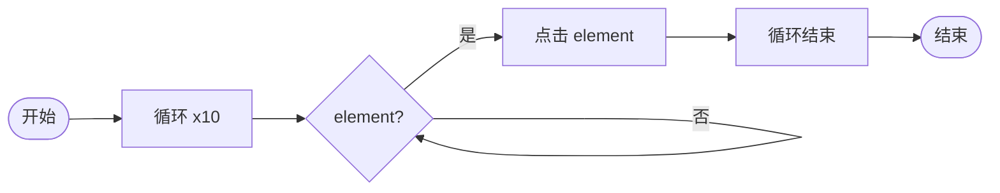

# 视觉成功点击 10 次

> mouse-suite-flow v1
> 仅匹配成功才点击；否分支重试，不占循环次数。



```mouse-suite-flow
{
  "version": 1,
  "title": "视觉成功点击 10 次",
  "nodes": [
    {
      "id": 1,
      "kind": "Start",
      "pos": [60.0, 180.0],
      "element_name": "element",
      "fallback": "",
      "threshold": 0.8,
      "pure_vision": false,
      "retries": 0,
      "retry_ms": 500,
      "on_fail": "skip",
      "seconds": 1,
      "max_times": 50,
      "message": "请确认后继续",
      "instruction": "",
      "type_text": "",
      "type_interval_ms": 30
    },
    {
      "id": 2,
      "kind": "LoopStart",
      "pos": [260.0, 180.0],
      "element_name": "element",
      "fallback": "",
      "threshold": 0.8,
      "pure_vision": false,
      "retries": 0,
      "retry_ms": 500,
      "on_fail": "skip",
      "seconds": 10,
      "max_times": 50,
      "message": "请确认后继续",
      "instruction": "",
      "type_text": "",
      "type_interval_ms": 30
    },
    {
      "id": 3,
      "kind": "IfVision",
      "pos": [480.0, 180.0],
      "element_name": "element",
      "fallback": "",
      "threshold": 0.85,
      "pure_vision": false,
      "retries": 0,
      "retry_ms": 300,
      "on_fail": "skip",
      "seconds": 1,
      "max_times": 50,
      "message": "请确认后继续",
      "instruction": "",
      "type_text": "",
      "type_interval_ms": 30
    },
    {
      "id": 4,
      "kind": "Click",
      "pos": [720.0, 120.0],
      "element_name": "element",
      "fallback": "",
      "threshold": 0.85,
      "pure_vision": false,
      "retries": 0,
      "retry_ms": 500,
      "on_fail": "skip",
      "seconds": 1,
      "max_times": 50,
      "message": "请确认后继续",
      "instruction": "",
      "type_text": "",
      "type_interval_ms": 30
    },
    {
      "id": 5,
      "kind": "LoopEnd",
      "pos": [960.0, 180.0],
      "element_name": "element",
      "fallback": "",
      "threshold": 0.8,
      "pure_vision": false,
      "retries": 0,
      "retry_ms": 500,
      "on_fail": "skip",
      "seconds": 1,
      "max_times": 50,
      "message": "请确认后继续",
      "instruction": "",
      "type_text": "",
      "type_interval_ms": 30
    },
    {
      "id": 6,
      "kind": "End",
      "pos": [1180.0, 180.0],
      "element_name": "element",
      "fallback": "",
      "threshold": 0.8,
      "pure_vision": false,
      "retries": 0,
      "retry_ms": 500,
      "on_fail": "skip",
      "seconds": 1,
      "max_times": 50,
      "message": "请确认后继续",
      "instruction": "",
      "type_text": "",
      "type_interval_ms": 30
    }
  ],
  "edges": [
    { "from": 1, "to": 2, "branch": "main" },
    { "from": 2, "to": 3, "branch": "main" },
    { "from": 3, "to": 4, "branch": "true" },
    { "from": 3, "to": 3, "branch": "false" },
    { "from": 4, "to": 5, "branch": "main" },
    { "from": 5, "to": 6, "branch": "main" }
  ],
  "next_id": 7
}
```
